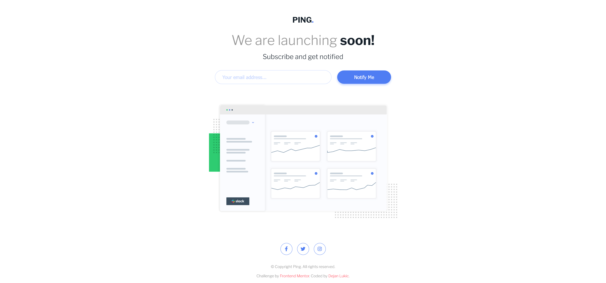
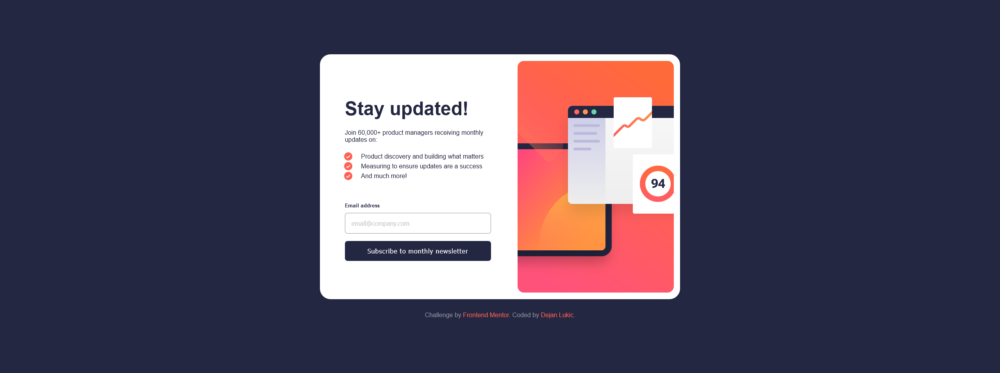
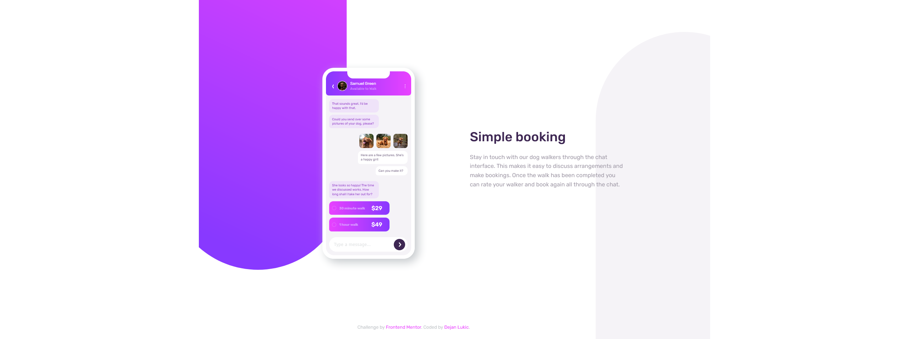

7. Ping coming soon page

- Solution URL: [Solution](https://github.com/DejanSheki/FrontendMentor-challenges/tree/main/ping-coming-soon-page-master)
- Live Site URL: [Live Preview](https://dejansheki.github.io/FrontendMentor-challenges/ping-coming-soon-page-master/)

6. Newsletter Sign Up With Success Message

- Solution URL: [Solution](https://github.com/DejanSheki/FrontendMentor-challenges/tree/main/newsletter-sign-up-with-success-message-main)
- Live Site URL: [Live Preview](https://dejansheki.github.io/FrontendMentor-challenges/newsletter-sign-up-with-success-message-main/)

5. Interactive rating component

- Solution URL: [Solution](https://github.com/DejanSheki/FrontendMentor-challenges/tree/main/interactive-rating-component-main)

- Live Site URL: [Live Preview](https://dejansheki.github.io/FrontendMentor-challenges/interactive-rating-component-main)

4. Interactive pricing component

- Solution URL: [Solution](https://github.com/DejanSheki/FrontendMentor-challenges/tree/main/interactive-pricing-component-main)
- Live Site URL: [Live Preview](https://dejansheki.github.io/FrontendMentor-challenges/interactive-pricing-component-main/)

3. Chat app css illustration

- Solution URL: [Solution](https://github.com/DejanSheki/FrontendMentor-challenges/tree/main/chat-app-css-illustration-master)
- Live Site URL: [Live Preview](https://dejansheki.github.io/FrontendMentor-challenges/chat-app-css-illustration-master/)

2. Huddle landing page with alternating feature blocks master

- Solution URL: [Solution](https://github.com/DejanSheki/FrontendMentor-challenges/tree/main/huddle-landing-page-with-alternating-feature-blocks-master)
- Live Site URL: [Live Preview](https://dejansheki.github.io/FrontendMentor-challenges/huddle-landing-page-with-alternating-feature-blocks-master/)

1. 3 Column Preview Card Component

- Solution URL: [Solution](https://github.com/DejanSheki/FrontendMentor-challenges/tree/main/3-column-preview-card-component-main)
- Live Site URL: [Live Preview](https://dejansheki.github.io/FrontendMentor-challenges/3-column-preview-card-component-main/)

## Author

- Website - [Dejan Lukic](https://www.dejanlukic.com)
- Frontend Mentor - [@DejanSheki](https://www.frontendmentor.io/profile/DejanSheki)
- Twitter - [@DejanSheki](https://twitter.com/DejanSheki)
- CSSBattle - [@dejansheki](https://cssbattle.dev/player/dejansheki)
