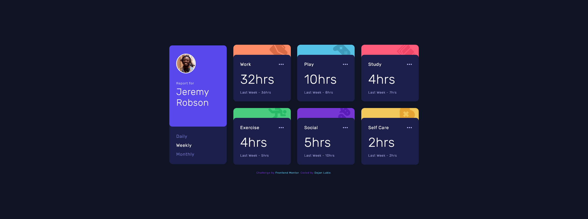
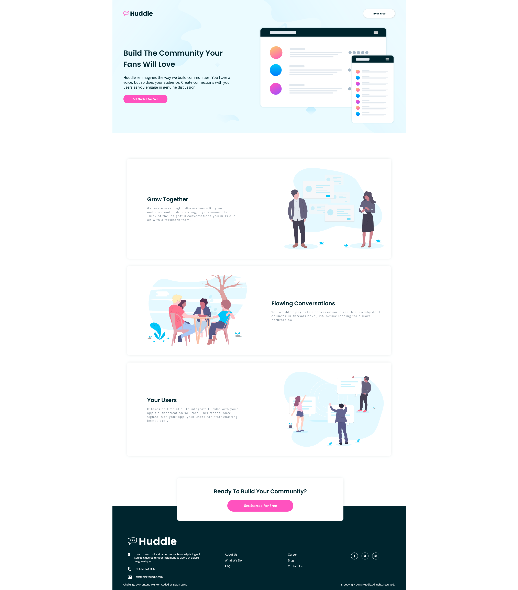

12. <h2>Launch countdown timer</h2>

- Solution URL: [Solution](https://github.com/DejanSheki/FrontendMentor-challenges/tree/main/launch-countdown-timer-main)
- Live Site URL: [Live Preview](https://dejansheki.github.io/FrontendMentor-challenges/launch-countdown-timer-main/)

 

11. <h2>Space tourism website</h2>

- Solution URL: [Solution](https://github.com/DejanSheki/FrontendMentor-challenges/tree/main/space-tourism-website-main)
- Live Site URL: [Live Preview](https://dejansheki.github.io/FrontendMentor-challenges/space-tourism-website-main/)

 

10. <h2>Time tracking dashboard</h2>

- Solution URL: [Solution](https://github.com/DejanSheki/FrontendMentor-challenges/tree/main/time-tracking-dashboard-main)
- Live Site URL: [Live Preview](https://dejansheki.github.io/FrontendMentor-challenges/time-tracking-dashboard-main/)

 

9. <h2>Ping coming soon page</h2>

- Solution URL: [Solution](https://github.com/DejanSheki/FrontendMentor-challenges/tree/main/ping-coming-soon-page-master)
- Live Site URL: [Live Preview](https://dejansheki.github.io/FrontendMentor-challenges/ping-coming-soon-page-master/)

 

8. <h2>Newsletter Sign Up With Success Message</h2>

- Solution URL: [Solution](https://github.com/DejanSheki/FrontendMentor-challenges/tree/main/newsletter-sign-up-with-success-message-main)
- Live Site URL: [Live Preview](https://dejansheki.github.io/FrontendMentor-challenges/newsletter-sign-up-with-success-message-main/)

 

7. <h2>Interactive rating component</h2>

- Solution URL: [Solution](https://github.com/DejanSheki/FrontendMentor-challenges/tree/main/interactive-rating-component-main)
- Live Site URL: [Live Preview](https://dejansheki.github.io/FrontendMentor-challenges/interactive-rating-component-main)

 

6. <h2>Interactive pricing component</h2>

- Solution URL: [Solution](https://github.com/DejanSheki/FrontendMentor-challenges/tree/main/interactive-pricing-component-main)
- Live Site URL: [Live Preview](https://dejansheki.github.io/FrontendMentor-challenges/interactive-pricing-component-main/)

 

5. <h2>Chat app css illustration</h2>

- Solution URL: [Solution](https://github.com/DejanSheki/FrontendMentor-challenges/tree/main/chat-app-css-illustration-master)
- Live Site URL: [Live Preview](https://dejansheki.github.io/FrontendMentor-challenges/chat-app-css-illustration-master/)

 

4. <h2>Huddle landing page with alternating feature blocks master</h2>

- Solution URL: [Solution](https://github.com/DejanSheki/FrontendMentor-challenges/tree/main/huddle-landing-page-with-alternating-feature-blocks-master)
- Live Site URL: [Live Preview](https://dejansheki.github.io/FrontendMentor-challenges/huddle-landing-page-with-alternating-feature-blocks-master/)

 

3. <h2>3 Column Preview Card Component</h2>

- Solution URL: [Solution](https://github.com/DejanSheki/FrontendMentor-challenges/tree/main/3-column-preview-card-component-main)
- Live Site URL: [Live Preview](https://dejansheki.github.io/FrontendMentor-challenges/3-column-preview-card-component-main/)

 

2. <h2>Testimonials grid section</h2>

- Solution URL: [Solution](https://github.com/DejanSheki/FrontendMentor-challenges/tree/main/testimonials-grid-section-main)
- Live Site URL: [Live Preview](https://dejansheki.github.io/FrontendMentor-challenges/testimonials-grid-section-main/)

 

1. <h2>Order summary component</h2>

- Solution URL: [Solution](https://github.com/DejanSheki/FrontendMentor-challenges/tree/main/order-summary-component-main)
- Live Site URL: [Live Preview](https://dejansheki.github.io/FrontendMentor-challenges/order-summary-component-main/)

 

## Author

- Website - [Dejan Lukic](https://www.dejanlukic.com)
- Frontend Mentor - [@DejanSheki](https://www.frontendmentor.io/profile/DejanSheki)
- Twitter - [@DejanSheki](https://twitter.com/DejanSheki)
- CSSBattle - [@dejansheki](https://cssbattle.dev/player/dejansheki)
