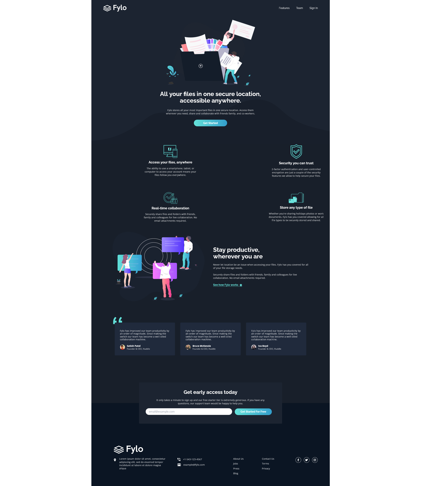

# Frontend Mentor - Fylo dark theme landing page solution

This is a solution to the [Fylo dark theme landing page challenge on Frontend Mentor](https://www.frontendmentor.io/challenges/fylo-dark-theme-landing-page-5ca5f2d21e82137ec91a50fd). Frontend Mentor challenges help you improve your coding skills by building realistic projects.

## The challenge

Your challenge is to build out this landing page and get it looking as close to the design as possible.
You can use any tools you like to help you complete the challenge. So if you've got something you'd like to practice, feel free to give it a go.
Your users should be able to:

- View the optimal layout for the site depending on their device's screen size
- See hover states for all interactive elements on the page

### Screenshot

### Built with

### Built with

- Semantic HTML5 markup
- Flexbox
- CSS Grid
- JavaScript
- TailwindCSS

### What I learned

Learning TailwindCSS for the first time! Excited to explore the endless possibilities of this powerful CSS framework.

### Continued development

Use this section to outline areas that you want to continue focusing on in future projects. These could be concepts you're still not completely comfortable with or techniques you found useful that you want to refine and perfect.

## Author

- Website - [Dejan Lukic](https://www.dejanlukic.com)
- Frontend Mentor - [@DejanSheki](https://www.frontendmentor.io/profile/DejanSheki)
- Twitter - [@DejanSheki](https://twitter.com/DejanSheki)
- CSSBattle - [@dejansheki](https://cssbattle.dev/player/dejansheki)
